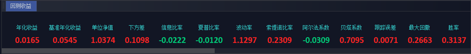
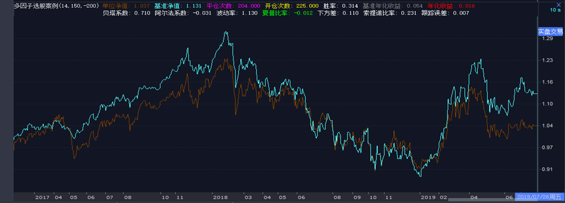

# 策略应用1——多因子选股
Tip: from [iQuant课堂](https://www.guosen.com.cn/gs/iquant/iQuantClassRoom_detail.html?channelid=000100010002000300020003&id=31366)
<h1 align="center">多因子选股策略</h1>

```python 
#!/usr/bin/python  
# coding:gbk
'''
策略以HS300为基础股票池，在日线下运行，20个交易日进行一次调仓，每次买入在买入备选中因子评分前10的股票，每支股票各分配当前可用资金的10%（权重可调整） 
扩展数据需要在补完HS300成分股数据之后生成，本模型中扩展数据暂时使用VBA指标ATR和ADTM生成，命名为atr和adtm 
'''

import pandas as pd  
import numpy as np  
import time  
import datetime  
#1. ===========================================初始化部分=============================================  

def init(ContextInfo):  
    # 获取沪深300成分股  
    ContextInfo.s = ContextInfo.get_sector('000300.SH')  
    # 设定基础股票池为沪深300成分股  
    ContextInfo.set_universe(ContextInfo.s)  
    # 策略运行天数  
    ContextInfo.day = 0  
    # 持仓情况  
    ContextInfo.holdings = {i: 0 for i in ContextInfo.s}  
    # 资金权重  
    ContextInfo.weight = [0.1] * 10  # 设置资金分配权重  
    # 买入点  
    ContextInfo.buypoint = {}  
    # 可用资金？  
    ContextInfo.money = ContextInfo.capital  
    # 策略盈利  
    ContextInfo.profit = 0  
    # 设置交易账户  
    ContextInfo.accountID = 'testS'  

#1. ===========================================初始化部分=============================================  

#2. ===========================================周期循环部分===========================================  

def handlebar(ContextInfo):  
    rank1 = {}  
    rank2 = {}  
    rank_total = {}  
    tmp_stock = {}  
    # 当前bar线索引号  
    d = ContextInfo.barpos  
    # 获取过去1日的开盘价数据  
    price = ContextInfo.get_history_data(1, '1d', 'open', 3)  
    # 策略运行天数大于60天且到达20天的调仓周期  
    if d > 60 and d % 20 == 0:  
        # 当前bar线日期  
        nowDate = timetag_to_datetime(ContextInfo.get_bar_timetag(d), '%Y%m%d')  
        # print(nowDate)  
        # 获取待买入、卖出股票池  
        buys, sells = signal(ContextInfo)  
        #  
        order = {}  
        # 获取待买入  
        for k in buys.keys():  
            if buys[k] == 1:  
                # 获取待买入个股在所有品种中的atr排名  
                rank1[k] = ext_data_rank(  
                    'atr', k[-2:] + k[0:6], 0, ContextInfo)  
                # 获取待买入个股在所有品种中的adtm排名  
                rank2[k] = ext_data_rank(  
                    'adtm', k[-2:] + k[0:6], 0, ContextInfo)  
                #print(rank1[k], rank2[k])  
                # 人为设置因子的权重，此处取了0.5和-0.5  
                rank_total[k] = 0.5 * rank1[k] - 0.5 * rank2[k]  
        # 对rank_total按照值value进行排序，并返回一个列表，列表里面的元素是形如(code,value)的元组  
        tmp = sorted(rank_total.items(), key=lambda item: item[1])  
        # print(tmp)  
        # 如果买入备选股票数大于10只，则选取因子排序最小的10只  
        if len(tmp) >= 10:  
            tmp_stock = {i[0] for i in tmp[:10]}  
        # 如果买入备选股票数小于10只，则全选  
        else:  
            tmp_stock = {i[0] for i in tmp}  
        for k in buys.keys():  
            if k not in tmp_stock:  
                buys[k] = 0  
        if tmp_stock:  
            print('买入备选股票列表:', tmp_stock)  
            for k in ContextInfo.s:  
                # 卖出持仓中待卖出的股票  
                if ContextInfo.holdings[k] > 0 and sells[k] == 1:  
                    print('ready to sell')  
                    # 将持仓中待卖出股票以昨日收盘价清仓  
                    order_shares(  
                        k, -ContextInfo.holdings[k] * 100, 'fix', price[k][-1], ContextInfo, ContextInfo.accountID)  
                    # 计算账户可用资金（手续费按万三设定）  
                    ContextInfo.money += price[k][-1] * ContextInfo.holdings[k] * \  
                        100 - 0.0003 * \  
                        ContextInfo.holdings[k] * 100 * price[k][-1]  
                    # 计算账户盈利  
                    ContextInfo.profit += (price[k][-1] - ContextInfo.buypoint[k]) * ContextInfo.holdings[k] * \  
                        100 - 0.0003 * \  
                        ContextInfo.holdings[k] * 100 * price[k][-1]  
                    # print(price[k][-1])  
                    # print(k)  
                    # print(ContextInfo.money)  
                    ContextInfo.holdings[k] = 0  
            # 为待买入股票等权分配资金  
            ContextInfo.money_distribution = {  
                k: i * ContextInfo.money for (k, i) in zip(tmp_stock, ContextInfo.weight)}  
            for k in tmp_stock:  
                # 买入持仓中没有的买入备选股票列表  
                if ContextInfo.holdings[k] == 0 and buys[k] == 1:  
                    print('ready to buy')  
                    # 备选股票买入手数  
                    order[k] = int(  
                        ContextInfo.money_distribution[k] / (price[k][-1])) / 100  
                    # 以昨日收盘价买入备选股票  
                    order_shares(  
                        k, order[k] * 100, 'fix', price[k][-1], ContextInfo, ContextInfo.accountID)  
                    # 记录买点  
                    ContextInfo.buypoint[k] = price[k][-1]  
                    # 计算可用资金  
                    ContextInfo.money -= price[k][-1] * order[k] * \  
                        100 - 0.0003 * order[k] * 100 * price[k][-1]  
                    # 记录盈利  
                    ContextInfo.profit -= 0.0003 * \  
                        order[k] * 100 * price[k][-1]  
                    print(k)  
                    # 记录持仓中备选股票对应手数  
                    ContextInfo.holdings[k] = order[k]  
            print(ContextInfo.money, ContextInfo.profit, ContextInfo.capital)  
    # 计算利润率  
    profit = ContextInfo.profit / ContextInfo.capital  
    # 进行回测则画出利润率曲线  
    if not ContextInfo.do_back_test:  
        ContextInfo.paint('profit_ratio', profit, -1, 0)  

#2. ===========================================周期循环部分===========================================  

#3. ===========================================初步删选股票池=========================================  

def signal(ContextInfo):  
    buy = {i: 0 for i in ContextInfo.s}  
    sell = {i: 0 for i in ContextInfo.s}  
    # 获取基础股票池历史22天的日最高价  
    data_high = ContextInfo.get_history_data(22, '1d', 'high', 3)  
    # 获取基础股票池历史2天的日最高价  
    data_high_pre = ContextInfo.get_history_data(2, '1d', 'high', 3)  
    # 获取基础股票池历史62天的日收盘价  
    data_close60 = ContextInfo.get_history_data(62, '1d', 'close', 3)  
    # print(data_high)  
    # print(data_close)  
    # print(data_close60)  
    for k in ContextInfo.s:  
        if data_close60.has_key(k):  
            # 过去62天未出现停牌，数据齐全  
            if len(data_high_pre[k]) == 2 and len(data_high[k]) == 22 and len(data_close60[k]) == 62:  
                # 超过20日最高价，加入买入备选  
                if data_high_pre[k][-2] > max(data_high[k][:-2]):  
                    buy[k] = 1  
                # 低于60日均线，加入卖出备选  
                elif data_high_pre[k][-2] < np.mean(data_close60[k][:-2]):  
                    sell[k] = 1  
    # print(buy)  
    # print(sell)  
    return buy, sell  

#3. ===========================================初步删选股票池=========================================
```

## 回测参数设置（回测频率、周期、手续费等可视化设置）：


## 回测结果展示：
### 回测收益：


### 回测净值曲线：

