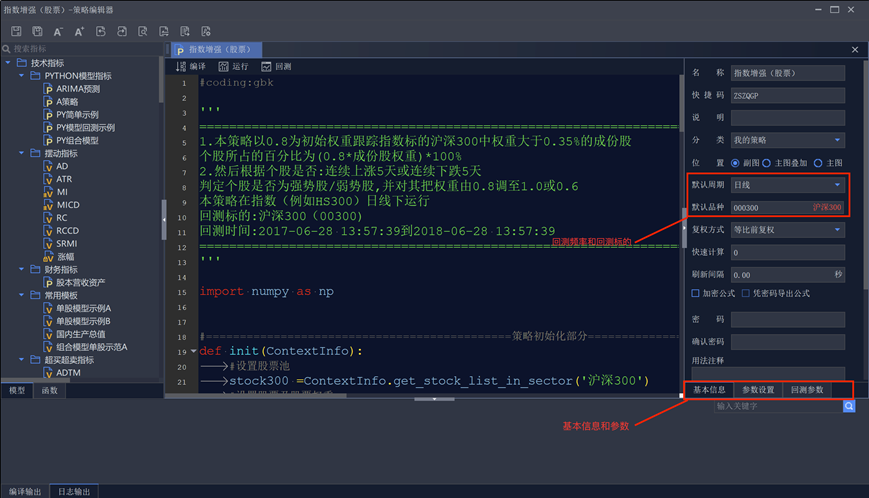
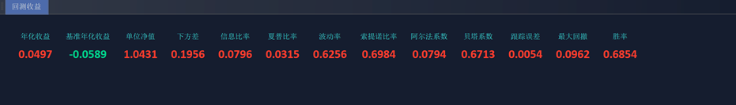
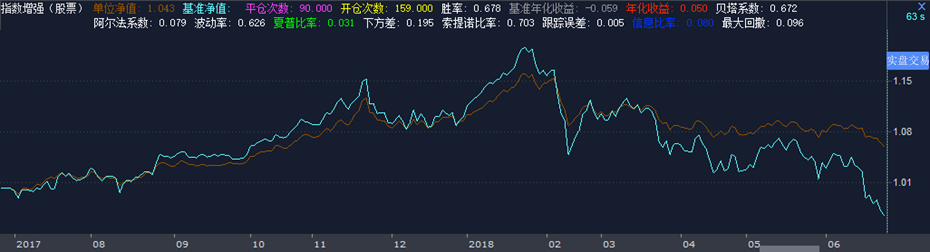

# 策略应用2——指数增强策略
Tip: from [iQuant课堂](https://www.guosen.com.cn/gs/iquant/iQuantClassRoom_detail.html?channelid=000100010002000300020003&id=31435)
<h1 align="center">指数增强策略</h1>

```python 
#coding:gbk  
  
''' 
================================================================================================
1.本策略以0.8为初始系数跟踪指数标的沪深300中权重大于0.35%的成份股 
个股所占的百分比为(0.8*成份股权重)*100% 
2.然后根据个股是否:连续上涨5天或连续下跌5天 
判定个股是否为强势股/弱势股,并对其把系数由0.8调至1.0或0.6 
本策略在指数（例如HS300）日线下运行 
回测标的:沪深300（00300) 
回测时间:2017-06-28 13:57:39到2018-06-28 13:57:39 
================================================================================================
'''  
  
import numpy as np  
  
  
#=============================================策略初始化部分====================================  
def init(ContextInfo):  
    #设置股票池  
    stock300 =ContextInfo.get_stock_list_in_sector('沪深300')  
    #设置股票及股票权重  
    ContextInfo.stock300_weight = {}  
    stock300_symbol = []  
    stock300_weightlist = []   
  
    #股票代码  
    ContextInfo.index_code = ContextInfo.stockcode+"."+ContextInfo.market  
  
    # 保留权重大于0.35%的成份股  
    for key in stock300:  
        if (ContextInfo.get_weight_in_index(ContextInfo.index_code, key) / 100) > 0.0035:  
            stock300_symbol.append(key)  
           ContextInfo.stock300_weight[key] = ContextInfo.get_weight_in_index(ContextInfo.index_code, key) / 100  
            stock300_weightlist.append(ContextInfo.get_weight_in_index(ContextInfo.index_code, key) / 100)  
  
    print ("选择的成分股权重总和为:" , np.sum(stock300_weightlist)   )
  
    #设置筛选后股票池  
    ContextInfo.set_universe(stock300_symbol)  
  
    # 资产配置的初始系数0.6-0.8-1.0  
    ContextInfo.ratio = 0.8  
  
    #设置账号  
    ContextInfo.accountid = "testS"  
  
#=============================================策略周期循环部分================================== 
def handlebar(ContextInfo):  
    #获取当前bar线索引  
    index  = ContextInfo.barpos  
    #将毫秒时间转换为日期时间  
    realtimetag = ContextInfo.get_bar_timetag(index)  
    print (timetag_to_datetime(realtimetag, '%Y%m%d %H:%M:%S')  )
    #获取股票池内股票过去七天收盘价  
    dict_close=ContextInfo.get_history_data(7,'1d','close',3)  
    #初始化持仓市值  
    holdvalue = 0  
    #持仓手数  
    holdings=get_holdings(ContextInfo.accountid,"STOCK")  
    #获取账户剩余资金  
    surpluscapital=get_avaliablecost(ContextInfo.accountid,"STOCK")  
    #计算当日持仓市值  
    for stock in ContextInfo.stock300_weight:  
        if  stock  in holdings:  
            if len(dict_close[stock]) == 7:  
                #用前两天的收盘价计算前一日可用持仓市值  
                holdvalue += dict_close[stock][-2] * holdings[stock]*100  
      
    for stock in ContextInfo.stock300_weight:  
        # 若没有仓位则按照初始系数开仓  
        if  stock not in holdings and stock in dict_close.keys():  
            if len(dict_close[stock]) == 7:  
                #用pre_close储存前一天收盘价  
                pre_close = dict_close[stock][-1]  
                #持仓数量=成分股权重*资金/前一日收盘价  
                buy_num = int(ContextInfo.stock300_weight[stock] * ( holdvalue + surpluscapital ) *ContextInfo.ratio / pre_close /100)  
                order_shares(stock,buy_num*100,'fix',pre_close,ContextInfo,ContextInfo.accountid)  
        # 若有仓位判断是否为强势股/弱势股，调整系数后开仓  
        elif stock in dict_close.keys():  
            if len(dict_close[stock]) == 7:  
                #用前1~5日收盘价分别减去前2~6日收盘价  
                diff = np.array(dict_close[stock][1:6]) - np.array(dict_close[stock][:-2])  
                pre_close = dict_close[stock][-1]  
                #调整系数后的目标持仓手数  
                buytarget_num = int(ContextInfo.stock300_weight[stock] * ( holdvalue + surpluscapital ) * (ContextInfo.ratio + 0.2)/ pre_close /100)  
                selltarget_num = int(ContextInfo.stock300_weight[stock] * ( holdvalue + surpluscapital ) *(ContextInfo.ratio - 0.2)/ pre_close /100)  
  
                # 获取过去5天的价格数据,若连续上涨则为强势股,调仓到（初始系数+0.2）的仓位  
                if all(diff>0) and holdings[stock] < buytarget_num:  
                    #实际购买手数=购买后目标持仓手数-已持仓手数  
                    buy_num = buytarget_num - holdings[stock]  
                    order_shares(stock,buy_num*100,'fix',pre_close,ContextInfo,ContextInfo.accountid)  
  
                # 获取过去5天的价格数据,若连续下跌则为弱势股,调仓到（初始系数-0.2）的仓位  
                elif all(diff<0) and holdings[stock] > selltarget_num:  
                     #实际卖出手数=已持仓手数-卖出后目标持仓手数  
                    sell_num = holdings[stock] - selltarget_num  
                    order_shares(stock,(-1.0)*sell_num*100,'fix',pre_close,ContextInfo,ContextInfo.accountid)  
  
#================================获取持仓信息——股票可用余额{"code":股数}=======================
def get_holdings(accountid,datatype):  
    holdinglist={}  
    resultlist=get_trade_detail_data(accountid,datatype,"POSITION")  
    for obj in resultlist:  
        holdinglist[obj.m_strInstrumentID+"."+obj.m_strExchangeID]=obj.m_nVolume/100  
    return holdinglist  
  
#==========================================获取账户剩余资金=================================   
def get_avaliablecost(accountid,datatype):  
    result=0  
    resultlist=get_trade_detail_data(accountid,datatype,"ACCOUNT")  
    for obj in resultlist:  
         result=obj.m_dAvailable  
    return result
```

## 回测参数设置（回测频率、周期、手续费等可视化设置）：


## 回测结果展示：
### 回测收益：


### 回测净值曲线：

